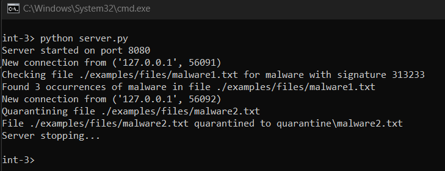
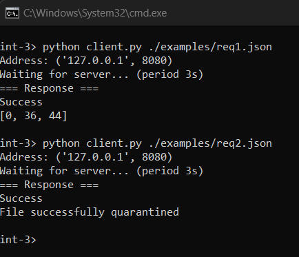

# INT-3 (Sandbox dev)

## 1. Настройка
- В `server.config.json`:
    - `THREADS_NUM` - максимальное количество одновременных соединений
    - `PORT` - порт сервера
    - `QUARANTINE_DIR` - директория для карантина
- В `client.config.json`:
    - `HOST` - IP сервера
    - `PORT` - порт сервера

## 2. Запуск
1. Запустить сервер
```
python3 server.py
```
2. Запустить клиент:
- вывести справку
```
python3 client.py
```
- отправить запрос
```
python3 client.py <путь к файлу с запросом>
```

## 3. Примеры
- Работа сервера



- Работа клиента


